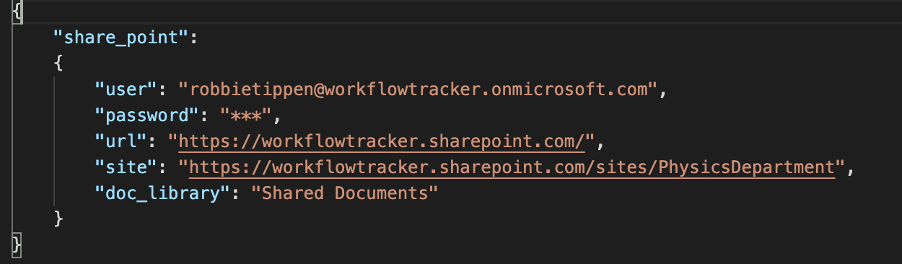
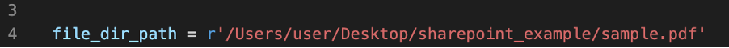
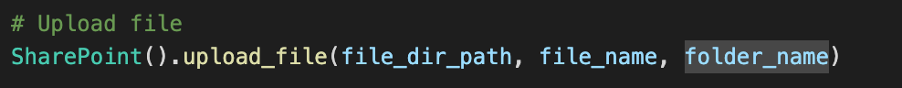
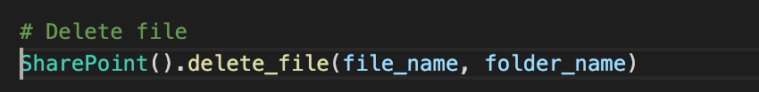
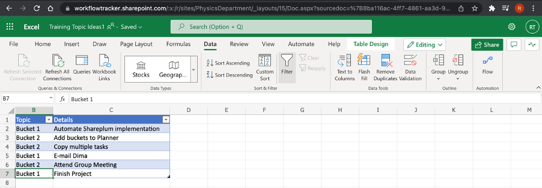
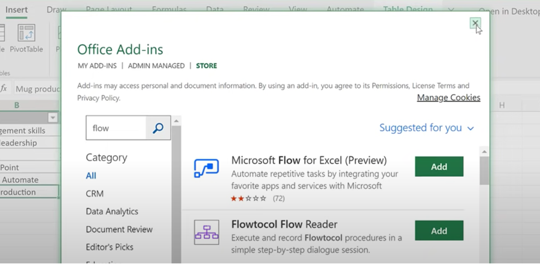
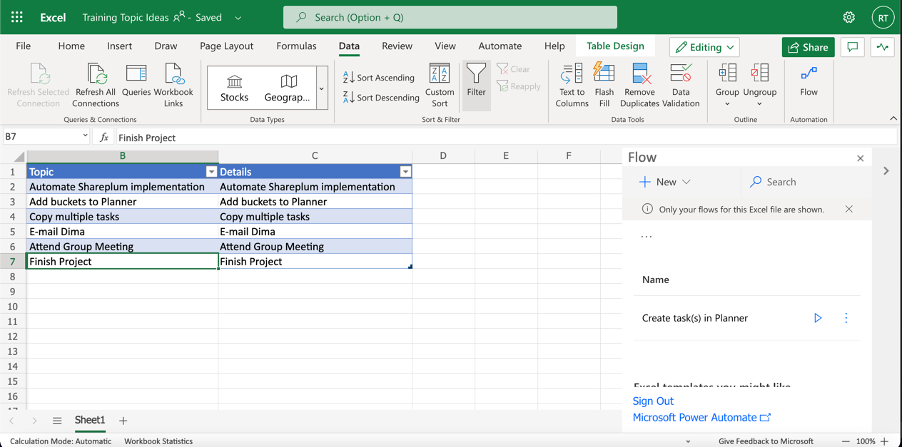
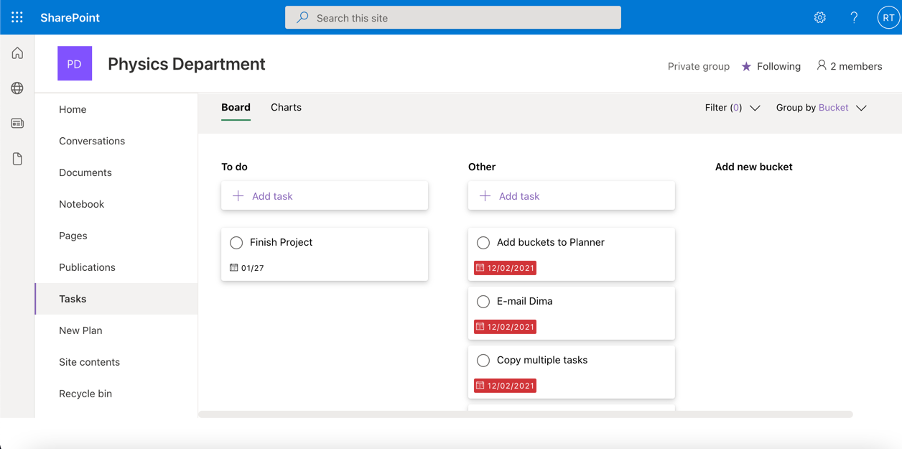

# ITk workflow tracker

## Contributors
- [Robbie Tippen](https://stgit.dcs.gla.ac.uk/2403237t), 2403237T
- [Jakub Jelinek](https://stgit.dcs.gla.ac.uk/2478625j), 2478625J

## Main customer
- Dima Maneuski

## Project itself
- Using python API (Shareplum) to connect to microsoft sharepoint.
- Implementing Power Automate functionality over microsoft sharepoint.

## Microsoft Developer account
The Microsoft Developer Account can be acquired through a free, renewable 90-day Microsoft 365 E5 developer subscription, which can be set up through this [link](https://developer.microsoft.com/en-us/microsoft-365/profile).

We found a microsoft developer account the most appropriate solution to creating a sharepoint that is compatible with shareplum. This is because it is free and does not have the restrictions that a sharepoint that was set up with a university login has, as we found these sharepoints to have problems connecting with shareplum. The purpose of the account is to set up a Sharepoint so it can be added to the `config.json` file and have files be transferrable through the python script. 

The developer account provides 25 user licenses that all can use the Sharepoints and Planners set up from the developer account. 

## How to use Shareplum to upload or delete files to Sharepoint

1.	In the `config.json` file swap the username and password with that of the one you will use for your Sharepoint. 

2.	Change the url variable to match the general Sharepoint url and the site variable to match that of the specific site within that Sharepoint you want to access. 

3.	`doc_library` is set to "Shared Documents" which is basically the main directory, if you have sub-folders within that you can add them on like "Shared Documents/[insert name of sub-folder]".

4.	In project.py replace what is in the quotation marks for `file_dir_path` with the local directory path to the file you want to upload.

5.	If you want to upload a file then uncomment the line of code under `# Upload file` (make sure the line of code under `# Delete file` is commented out)

6.	If you want to delete a file then uncomment the line of code under `# Delete file` (make sure the line of code under `# Upload file` is commented out)

7.	Finally run the `project.py` file and the entered file will appear in Sharepoint

## How to Create & Update Planner Tasks from Excel

1.	From Excel Spreadsheet that is within the SharePoint  associated with the Planner you wish to create tasks in select the 'Data tab.

If you are using Flow for the first time and it doesn’t appear as a tab within `Data` go to the `Insert` tab and access `Office Add-ins`. Search for `Flow` and just add it.

2.	Select the row you would like to add to the Planner as a Task and select `Flow`. You should then see the name of the Flow associated with the Excel file. Click on run.

If it is your first time running it the Flow will prompt you to sign in with your Microsoft account, do so if you have not already and continue.

3.	You will then be prompted to input a Due Date associated with the task and the bucket you want it to fall under in Planner, do this and then hit the `Run Flow` button. The task with its description and due date should now appear in the Planner under the specified bucket.

## How to run example_test
In the `config.json` file swap the username and password with that of the one you will use for your Sharepoint. Change the url variable to match the general Sharepoint url and the site variable to match that of the specific site within that Sharepoint you want to access. `doc_library` is set to "Shared Documents" which is basically the main directory, if you have sub-folders within that you can add them on like "Shared Documents/[insert name of sub-folder]".

In project.py you would just replace whats in the quotation marks with the directory path to the file you want to upload and then if you want to upload a file then uncomment the line of code under `# Upload file` and it's the same process with `Delete file`.

## Resources
We found this video very helpful with understanding the process of uploading to Sharepoint through Shareplum:

- :notebook: [Upload and Delete file to Sharepoint with Python](https://www.youtube.com/watch?v=BV6SLhOF3zU)   

We also found this video useful in setting up the Microsoft Developer Account and understaning its features:

- :notebook: [Set-up Office 365 Developer Account](https://www.youtube.com/watch?v=fZp8wiBJHJg)
